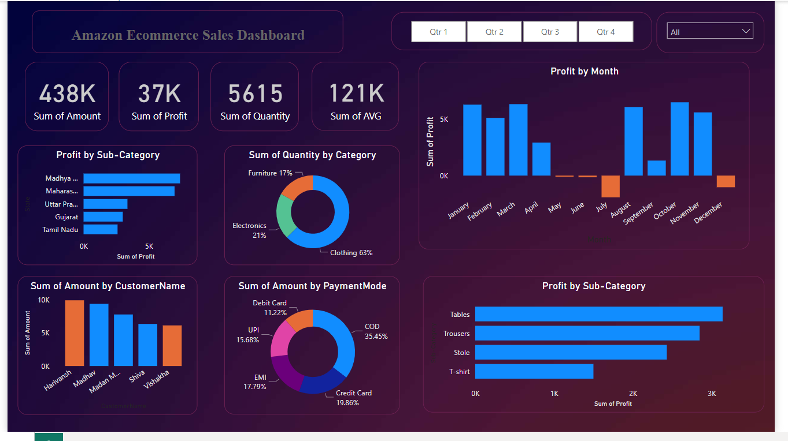

# Ecommerce Data Analysis Report using Power BI

## Project Overview

This project is focused on analyzing e-commerce order and sales data using **Power BI**. The analysis aims to provide insightful visualizations and reports for better business decision-making. The dataset consists of two main CSV files: `Orders.csv` and `Details.csv`, containing information about customer orders and the corresponding sales details. 

The report includes various data visualization techniques to highlight key metrics, such as total sales, order volume, and customer demographics.

## Key Objectives

1. **Sales Performance Analysis**:
   - Track and analyze the total sales across different time periods.
   - Understand the sales trends and identify peak periods of order volume.

2. **Customer Analysis**:
   - Analyze the geographic distribution of customers.
   - Identify the top customers based on total order value.
   - Segment customers based on purchasing behavior and frequency.

3. **Order Analysis**:
   - Breakdown of total orders by category, region, and other key attributes.
   - Visualize order status (completed, pending, canceled) and delivery times.

4. **Product Insights**:
   - Determine the best-selling products and product categories.
   - Analyze sales per product and product performance over time.

5. **Profitability**:
   - Track revenue and profits from orders.
   - Visualize margins and costs associated with different products.

## Data Description

- **Orders.csv**: Contains detailed information about customer orders such as order ID, customer name, order date, shipping details, and total order amount.
  - Columns include: `OrderID`, `CustomerName`, `OrderDate`, `ShipCity`, `ShipCountry`, `OrderAmount`, etc.

- **Details.csv**: Contains detailed line items for each order, including the products ordered, quantity, price per unit, and discount applied.
  - Columns include: `OrderID`, `ProductID`, `ProductName`, `Quantity`, `UnitPrice`, `Discount`, etc.

## Power BI Dashboard Features

The Power BI report includes the following features:

1. **Sales Dashboard**:
   - A dashboard showing real-time sales data with KPIs for Total Sales, Total Orders, and Average Order Value.
   - Time-series charts for tracking sales trends over months and years.
   - Visual breakdown of sales by region and product category.

2. **Customer Insights Dashboard**:
   - A dashboard highlighting customer demographics and top buyers.
   - Visualizations showing customer distribution across different regions and cities.

3. **Product Performance Dashboard**:
   - A report showing best-selling products and product categories.
   - Analysis of revenue generated from each product and category over time.

4. **Profit & Cost Analysis**:
   - A dashboard showing profit margins and cost breakdown by product category.
   - Visualizations tracking product-wise profitability.

## Technologies Used

- **Power BI**: For creating data models, interactive visualizations, and dashboards.
- **CSV files**: Data sources containing orders and detailed sales information.

## How to Run the Project

1. Clone the repository:
   ```bash
   git clone https://github.com/hamzak786/Ecommerce-Data-analysis-report.git
   ```

2. Open the provided Power BI `.pbix` file in Power BI Desktop.

3. Load the datasets (`Orders.csv` and `Details.csv`) into Power BI.

4. Review the pre-built dashboards and visualizations in the report.

## Screenshots
      
Screenshots of the Power BI dashboards here for visual reference.


## Conclusion

This Power BI report provides valuable insights into the e-commerce business, helping stakeholders make informed decisions about sales performance, customer behavior, and product profitability. The dynamic and interactive nature of the Power BI dashboards allows for deeper exploration of the data and facilitates strategic planning.

---

Feel free to adjust the content to suit the specific aspects of your project! Let me know if you need any modifications.
